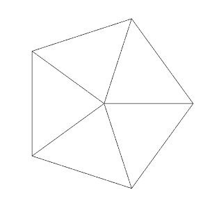
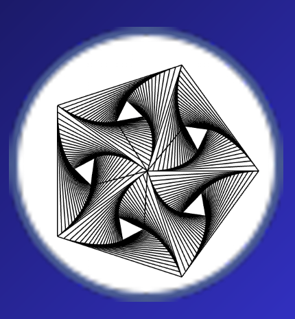

# Linear Interpolation of Triangles in a Pentagon

This project demonstrates **linear interpolation of points inside triangles** to generate a visual representation of a pentagon. It is implemented in **C++** using **OpenGL**, **GLFW**, and **GLEW**. The project showcases fundamental graphics programming concepts such as vertex buffer objects (VBOs), vertex array objects (VAOs), shaders, and basic rendering pipelines.

---

## Features
- 🖼 **Pentagon Generation**: Computes the vertices of a regular pentagon programmatically  
- 🔺 **Triangle Interpolation**: Uses linear interpolation between a pentagon's center and its edges to generate points inside triangles  
- 💻 **OpenGL Rendering**: Draws interpolated points using shaders  
- 🎨 **Customizable**: Easily change the number of interpolation steps or pentagon size  

---

## Technical Details
- **Language:** C++  
- **Libraries:**  
  - [OpenGL](https://www.opengl.org/) – Graphics rendering  
  - [GLFW](https://www.glfw.org/) – Window and input handling  
  - [GLEW](http://glew.sourceforge.net/) – OpenGL extension loading  
  - [GLM](https://glm.g-truc.net/) – Math library for vectors and matrices  
- **Shaders:** Vertex and fragment shaders for rendering points  
- **Coordinate System:** Orthographic projection from `-1.0` to `1.0` on both axes  

---

## How It Works
1. Compute the vertices of a regular pentagon centered at the origin.  
2. Divide the pentagon into triangles formed by the center and adjacent vertices.  
3. Apply **linear interpolation** inside each triangle to generate intermediate points.  
4. Transfer vertex positions (and optional colors) to the GPU using **VBOs** and **VAOs**.  
5. Render the points with OpenGL using shaders.  

---

## Screenshots 📸


<div style="display: flex; gap: 20px; flex-wrap: wrap;">

  <div>
    
    <p style="text-align: center;">Pentagon</p>
  </div>

  <div>
    
    <p style="text-align: center;">Interpolated Triangles</p>
  </div>

  <div>
    
    <p style="text-align: center;">Colored Points Example</p>
  </div>

</div>

---

## Running the Project ▶️
1. Clone the repository:  
```bash
git clone https://github.com/ruipedrogil/Computer-Graphics-1st-Project.git
